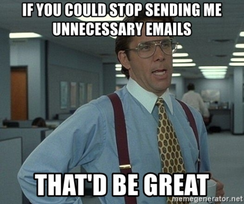

[//]: # (Constants)
[license-link]: ../../blob/main/LICENSE
[stars-link]: ../../stargazers
[vid-link]: https://www.youtube.com/shorts/CCbY_ETwFss
[website-link]: https://spark-games.co.uk
[coffee-link]: https://buymeacoffee.com/spark88
[bug-link]: ../../issues
[release-link]: ../../releases
[fork-link]: ../../fork
[privacy-link]: ./PRIVACY.md
[issues-link]: ../../issues

#  Gmail Manager MCP

<div align="center">

**🧹 Clean your inbox • 🏷️ Organize with labels • 🗑️ Bulk delete emails**


[](https://www.npmjs.com/package/@spark-apps/gmail-manager-mcp)
[](https://smithery.ai/server/@muammar-yacoob/gmail-manager-mcp)
[](LICENSE)

[](https://github.com/sponsors/muammar-yacoob)
[][coffee-link]
[][issues-link]
[][release-link]
[][stars-link]



</div>

## ✨ What It Does

Gmail Manager MCP gives Claude Desktop **direct access** to your Gmail inbox, allowing you to:

| Feature | Description |
|---------|-------------|
|  | Find emails by sender, subject, date, or any Gmail query |
|  | Create and apply labels to categorize emails automatically |
|  | Delete multiple emails at once based on your criteria |
|  | Get insights about your email patterns and volume |
|  | Remove old newsletters, notifications, and spam efficiently |

Perfect for **inbox zero enthusiasts** and anyone drowning in email overload! 📧💀

## 🚀 Installation

### 1. Get Gmail Credentials 🗝️
1. [Create New Project](https://console.cloud.google.com/projectcreate).
2. [Enable Gmail API](https://console.cloud.google.com/apis/api/gmail.googleapis.com/metrics).
3. Create [OAuth 2.0 Desktop credentials](https://console.cloud.google.com/auth/clients) and download as `gcp-oauth.keys.json`.
4. Navigate to [Data access](https://console.cloud.google.com/auth/scopes) and click **Add or remove scopes**.
5. In **Manually add scopes**, add both scopes:
   - `https://www.googleapis.com/auth/gmail.modify`
   - `https://www.googleapis.com/auth/gmail.settings.basic`
   Click **Add to table** then **Update** for each scope.
6. Navigate to [Test users](https://console.cloud.google.com/auth/audience) and add your Google email account as a test user. 

These scopes allow the Gmail Manager MCP to read, send, delete, and modify your emails, manage labels, and access basic Gmail settings.

```json
{
  "mcpServers": {
    "gmail-manager": {
      "command": "npx", "args": ["-y", "@spark-apps/gmail-manager-mcp@latest"],
      "env": {"GMAIL_OAUTH_PATH": "path/to/gcp-oauth.keys.json"}
    }
  }
}
```

**Or use local installation:**
```json
{
  "mcpServers": {
    "gmail-manager": {
      "command": "node", "args": ["path/to/gmail-mcp-server/dist/index.js"],
      "env": {"GMAIL_OAUTH_PATH": "path/to/gcp-oauth.keys.json"}
    }
  }
}
```

**Complete Setup:**

1. **Restart Claude Desktop** completely (close from tray area if needed)
2. **Try any Gmail command** from the examples below - Claude will automatically prompt for authentication
3. **Use the `authenticate_gmail` tool** when prompted - your browser will open for Gmail login
4. **Grant permissions** and return to Claude Desktop - you're ready to go! 🎉

*💡 Alternative: Run `npm run auth` in your terminal for manual setup*

## 🛠️ Available Tools

| Tool | Description |
|------|-------------|
|  | Authenticate Gmail access via web browser |
|  | Search emails using Gmail query syntax |
|  | Read the full content of an email |
|  | Permanently delete an email |
|  | Delete multiple emails at once |
|  | List all Gmail labels |
|  | Create a new Gmail label |
|  | Delete a Gmail label |
|  | Apply a label to an email |
|  | Remove a label from an email |
|  | Apply labels to multiple emails |

## 💬 Example Commands

### 🧹 Storage Cleanup Commands
- *"Delete all emails from noreply addresses older than 6 months"*
- *"Find and delete all promotional emails from shopping sites"*
- *"Remove all LinkedIn notification emails from the past year"*
- *"Delete all automated emails from GitHub, Slack, and Jira"*
- *"Clean up all newsletter emails I haven't opened in 3 months"*
- *"Delete all 'password reset' and 'account verification' emails"*
- *"Remove all calendar invites and meeting reminders older than 30 days"*
- *"Find and delete all emails with large attachments over 10MB"*

### 📊 Smart Organization
- *"Label all emails from banks and financial institutions as 'Finance'"*
- *"Create 'Archive-2024' label and move all old work emails there"*
- *"Find all subscription confirmation emails and label them 'Subscriptions'"*
- *"Group all travel booking confirmations under 'Travel' label"*

### 🔍 Inbox Analysis  
- *"Show me my top 10 email senders by volume this year"*
- *"Find all unread emails older than 1 month"*
- *"List all emails taking up the most storage space"*

---

## 🌱 Support & Contributions

⭐ **Star the repo** & I power up like Mario 🍄  
☕ **Devs run on coffee** - [Buy me one?][coffee-link]  
🤝 **Contributions are welcome** - [🍴 Fork][fork-link], improve, PR!

## 💖 Sponsor

If you find Gmail Manager MCP useful, please consider sponsoring the project! Your support helps maintain and improve the tool.

---

<div align="center">

**🚀 Ready to clean your inbox?**

**Made with ❤️ for Claude Desktop** • [Privacy Policy](PRIVACY.md) • [Terms of Service](TERMS.md)

</div>