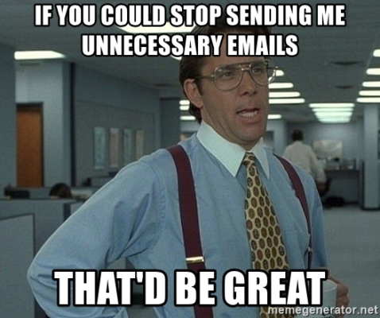

[//]: # (Constants)
[license-link]: ../../blob/main/LICENSE
[stars-link]: ../../stargazers
[vid-link]: https://www.youtube.com/shorts/CCbY_ETwFss
[website-link]: https://spark-games.co.uk
[coffee-link]: https://buymeacoffee.com/spark88
[bug-link]: ../../issues
[release-link]: ../../releases
[fork-link]: ../../fork
[privacy-link]: ./PRIVACY.md
[issues-link]: ../../issues
[discord-link]: https://discord.gg/S9kS2D5ueg

#  Gmail Manager MCP

<div align="center">

**🧹 Clean your inbox • 🏷️ Organize with labels • 🗑️ Bulk delete emails**


[](https://www.npmjs.com/package/@spark-apps/gmail-manager-mcp)
[](https://smithery.ai/server/@muammar-yacoob/gmail-manager-mcp)
[](LICENSE)

[](https://github.com/sponsors/muammar-yacoob)
[][coffee-link]
[][issues-link]
[][release-link]
[][stars-link]



</div>

## ✨ What It Does

Gmail Manager MCP provides **direct access** to your Gmail inbox through the Model Context Protocol, allowing you to:

| <div align="left">Feature</div> | <div align="left">Description</div> |
|:---------|:-------------|
|  | Find emails by sender, subject, date, or any Gmail query |
|  | Get insights about your email patterns and volume |
|  | Read the full content of an email |
|  | Create and apply labels to categorize emails automatically |
|  | Remove old newsletters, notifications, and spam efficiently |


## 🚀 Quick Setup 

### 📋 Prerequisites: Get Gmail Credentials 🗝️

<details>
<summary><strong>🔑 Required before any installation</strong></summary>

1. [Create New Project](https://console.cloud.google.com/projectcreate) 📁
2. [Enable Gmail API](https://console.cloud.google.com/apis/api/gmail.googleapis.com/metrics) 📧
3. Create [OAuth client ID](https://console.cloud.google.com/auth/clients) (Desktop app type) 🔐
4. Download as `gcp-oauth.keys.json` 📥
5. Navigate to [Data access](https://console.cloud.google.com/auth/scopes) → **Add or remove scopes** → Enter: `https://mail.google.com/` 🔓
6. Navigate to [Test users](https://console.cloud.google.com/auth/audience) → Add your Google email 👤

**📁 Where to put `gcp-oauth.keys.json`:**
- **If using npm (npx)**: Place it in your home directory  
  Windows: `%USERPROFILE%` • macOS/Linux: `~/`
- **If running locally from source**: Place it in the project root (same folder as `package.json`)
- **Or set a custom path**: Define `GMAIL_OAUTH_PATH` in your Claude Desktop config to point to the file

</details>

---

## 📥 Installation

<details>
<summary><strong>📦 Install from npm registry (Easier ⚡) </strong></summary>

```bash
npm i -g @spark-apps/gmail-manager-mcp
```
</details>

---

<details>
<summary><strong>🏠 Clone and build locally (Safer 🛡️)</strong></summary>

   ```bash
   git clone https://github.com/muammar-yacoob/GMail-Manager-MCP.git
   cd GMail-Manager-MCP
   npm install
   ```


</details>

---

## 💻 Terminal Usage

<details>
<summary><strong>🖥️ Quick Commands</strong></summary>

```bash
# Install globally
npm i -g @spark-apps/gmail-manager-mcp

# Run directly
npx @spark-apps/gmail-manager-mcp@latest

# Test connection
npx @spark-apps/gmail-manager-mcp@latest --test
```

</details>

---

## ⚙️ Configure MCP Client

<details>
<summary><strong>🔧 Required for all installation methods</strong></summary>

Add to your MCP client config file (Claude Desktop example):
- <span style="background: #1e90ff; color: white; padding: 2px 6px; border-radius: 3px; font-size: 11px; font-weight: bold;">Windows</span> `%APPDATA%\\Claude\\claude_desktop_config.json`
- <span style="background: #c0c0c0; color: black; padding: 2px 6px; border-radius: 3px; font-size: 11px; font-weight: bold;">macOS</span> `~/Library/Application Support/Claude/claude_desktop_config.json`
- <span style="background: #ffd700; color: black; padding: 2px 6px; border-radius: 3px; font-size: 11px; font-weight: bold;">Linux</span> `~/.config/Claude/claude_desktop_config.json`

**📦 For NPM Install:**
```json
{
  "mcpServers": {
    "gmail-manager": {
      "command": "npx", "args": ["@spark-apps/gmail-manager-mcp@latest"],
      "env": { "GMAIL_OAUTH_PATH": "C:\\path\\to\\gcp-oauth.keys.json" }
    }
  }
}
```

**For Local Development:**
```json
{
  "mcpServers": {
    "gmail-manager": {
      "command": "node", "args": ["C:\\path\\to\\GMail-Manager-MCP\\dist\\index.js"]
    }
  }
}
```
</details>

## 🛠️ Available Tools

<details>
<summary><strong>🔧 View All Available Tools</strong></summary>

| <div align="left">Tool</div> | <div align="left">Description</div> |
|:------|:-------------|
|  | Authenticate Gmail access via web browser |
|  | Search emails using Gmail query syntax |
|  | Read the full content of an email |
|  | Create a draft reply to an email with a smart, context-aware response |
|  | List all Gmail labels |
|  | Create a new Gmail label |
|  | Apply a label to an email |
|  | Apply labels to multiple emails |
|  | Remove a label from an email |
|  | Delete a Gmail label |
|  | Permanently delete an email |
|  | Delete multiple emails at once |

</details>

## 💬 Example Commands

<details>
<summary><strong>🧹 Quick Cleanup</strong></summary>

- *"Delete all promotional emails from last 30 days"*
- *"Delete all unread newsletters older than 1 week"*
- *"Delete all 'no-reply' emails from last 3 months"*
- *"Delete all LinkedIn notification emails"*
- *"Delete all password reset emails older than 1 month"*
- *"Delete redundant email chains where I'm CC'd"*

</details>

<details>
<summary><strong>⚡ Smart Actions</strong></summary>

- *"Summarize email with subject: 'last boring meeting'"*
- *"Summarize all emails about 'project deadline'"*
- *"Reply to email about 'project update' saying 'Got it, thanks!'"*
- *"Label all emails from my bank as 'Finance'"*
- *"Create 'Travel' label and move all booking confirmations"*
- *"Find emails with attachments larger than 5MB"*

</details>

<details>
<summary><strong>📊 Inbox Insights</strong></summary>

- *"Show me who sends me the most emails"*
- *"Find all unread emails older than 1 week"*
- *"Show my busiest email days this month"*
- *"Find emails I starred but never replied to"*

</details>

---

## 🌱 Support & Contributions

⭐ **Star the repo** & I power up like Mario 🍄  
☕ **Devs run on coffee** - [Buy me one?][coffee-link]  
🤝 **Contributions are welcome** - [🍴 Fork][fork-link], improve, PR!  
🎥 **Need help?**  [Setup Tutorial][vid-link] •  [Join Discord][discord-link]

## 💖 Sponsor
Your support helps maintain and improve the tool. please consider [sponsoring the project][stars-link]. 


---

<div align="center">


**Made with ❤️ for MCP** • [Privacy Policy](PRIVACY.md) • [Terms of Service](TERMS.md)


</div>
